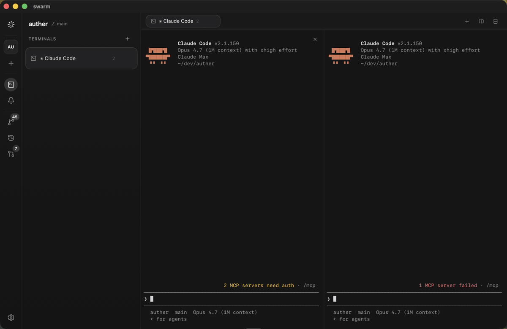

<div align="center">

# swarm

**Parallel terminals for your AI coding agents — with a built-in GitHub view: source control, diffs, and pull requests.**

A lightweight, cross-platform desktop app. Rust core, native webview, no Electron.

[](https://github.com/seizeddev/swarm/actions/workflows/ci.yml)
[](https://scorecard.dev/viewer/?uri=github.com/seizeddev/swarm)
[](./LICENSE)


<br />



</div>

---

## Why swarm

Running several Claude Code / Codex sessions at once is the new normal. The terminal is the easy part — what's missing is everything around it: what each agent changed, whether its PR is green, and getting back to exactly where you were after a restart.

[cmux](https://github.com/manaflow-ai/cmux) nailed the parallel-terminal experience but is deliberately *"a primitive, not a solution"*: it's macOS-only and leaves diffs and review to you. swarm keeps the terminal-first feel and adds the parts you keep reaching for:

- **GitHub view built in.** A VS Code-style Source Control panel (stage / commit / per-file diff via libgit2) and a Pull Requests panel from `gh` — review without leaving the app.
- **Work how you already work.** Local, no forced branches or worktrees. Terminals are the primary unit; git is a view you open when you want it.
- **Cross-platform & tiny.** Tauri 2 + a Rust core in a system webview. No Electron, no bundled Chromium.
- **A real terminal, done right.** VT emulation runs in Rust via the [Alacritty](https://github.com/alacritty/alacritty) engine; the UI just paints the cell grid. No xterm.js, so TUI agents like Claude Code render correctly.

## Install

**Download a ready-to-run build — no toolchain required.** Grab the file for your OS from the [latest release](https://github.com/seizeddev/swarm/releases/latest):

| OS | Download | Then |
| --- | --- | --- |
| **macOS** | `swarm_*_aarch64.dmg` (Apple Silicon) or `_x64.dmg` (Intel) | Open the `.dmg`, drag **swarm** to Applications. First launch: right-click → **Open** (the build is unsigned, so a normal double-click is blocked once). |
| **Linux** | `swarm_*_amd64.AppImage` | `chmod +x swarm_*.AppImage && ./swarm_*.AppImage` — or install the `.deb` with `sudo apt install ./swarm_*.deb`. |
| **Windows** | `swarm_*_x64-setup.exe` | Run the installer. On the SmartScreen prompt: **More info → Run anyway** (unsigned build). |

Optional: install [`gh`](https://cli.github.com) and run `gh auth login` to enable the Pull Requests panel. That's it — swarm stores no credentials and needs no further setup.

> No release yet? Build it yourself in two commands — see [Development](#development).

## Features

- **Multi-project workspaces** — open several repos at once; switch from the rail, each keeps its own terminals, source control, and PRs.
- **Infinite terminals + splits** — split right/down into a tiled layout with draggable dividers; sessions stay alive across tab and workspace switches.
- **Notifications** — when an agent needs you, its tab and workspace light up. Picks up OSC 9 / OSC 99 (kitty) / OSC 777 sequences and the bell, with a notifications panel, focus-aware suppression, and dedup.
- **Session restore** — workspaces, split layout, and working dirs are rebuilt on launch; agents relaunch with their resume command (`claude --continue`, `codex resume --last`).
- **Source Control** — staged/unstaged groups, stage/unstage, commit, GitHub-style per-file diffs (libgit2, no shelling out to `git`).
- **Pull Requests** — open PRs with passing / failing / pending checks, grouped by author (via the GitHub CLI; no tokens stored by swarm).
- **Agent-aware** — detects installed CLIs (Claude Code, Codex, Gemini, OpenCode, Amp, Cursor, Aider) and launches them in the right directory.

## Architecture

```
┌───────────────────────────────────────────────┐
│  React + Vite + Tailwind v4    (system webview) │
│  • cell-grid terminal renderer (no xterm.js)    │
│  • source control · history · PRs · terminals   │
└───────────────▲─────────────────────────────────┘
                │  Tauri IPC (commands + Channel)
┌───────────────┴─────────────────────────────────┐
│  Rust core (src-tauri)                           │
│  • git.rs       libgit2: diff/status/history     │
│  • terminal.rs  Alacritty VT engine + PTY        │
│  • github.rs    PR status via `gh`               │
│  • agents.rs    agent registry + detection       │
└──────────────────────────────────────────────────┘
```

Terminal bytes are parsed by the Alacritty engine **in Rust**; only the resulting cell grid (run-length-coalesced) is streamed to the frontend over a Tauri `Channel`. The webview never parses ANSI.

## Performance & security

- Native system webview + size-optimized Rust release profile (`lto`, `opt-level=s`, `panic=abort`, stripped).
- No bundled Chromium, no Node runtime shipped.
- Git operations use libgit2 directly — no shelling out to `git`.
- GitHub access is delegated to your existing `gh` auth; swarm stores no credentials.
- Tauri's capability system scopes what the frontend may call.

## Development

Prerequisites: [Rust](https://rustup.rs), [Node 20+](https://nodejs.org), and the [Tauri prerequisites](https://tauri.app/start/prerequisites/) for your OS. You **don't** need to install pnpm — it's pinned in `package.json` and activated by Corepack (bundled with Node).

```bash
git clone https://github.com/seizeddev/swarm.git
cd swarm
corepack enable     # activates the pinned pnpm — one time, no manual install
pnpm install
pnpm tauri dev      # run the app
pnpm tauri build    # produce a release bundle

# Rust core
cd src-tauri && cargo test
```

## License

[GNU General Public License v3.0 or later](./LICENSE) © swarm contributors.

swarm is **copyleft**: you may use, study, share, and modify it freely, but any
distributed derivative must also be released under the GPLv3. This keeps swarm
and its forks open — no one can ship a closed-source commercial version.
